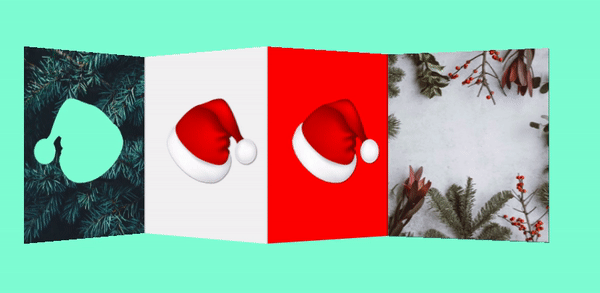

# Artifice

 **ar•ti•fice** *är′tə-fĭs* ►

    n.
    Deception or trickery.
    n.
    Something contrived or made up to achieve an end, especially by deceiving; a stratagem or ruse: synonym: wile.

This is home to (art) experiments to improve my web dev trickery.

Each experiment is organised into a folder. If the folder has:
- A subfolder with the title "original" - I recreated the original artwork in here (with a smidge of artistic license).
- A subfolder with the title "remix" -  this is where I go off and create my own thing.
- If there is neither of these subfolders, it's likely to be my own creation.

<!-- TOC -->
**Table of Contents**
1. [Straight Outta Some Swiss Canton](#straight-outta-some-swiss-canton)
1. [Join the Alliance (Star Wars)](#join-the-alliance-star-wars)
1. [They See Me Rollin](#they-see-me-rollin)
1. [Dada](#dada)
1. [Train Parallax](#train-parallax)
1. [Black to White Disks](#black-to-white-disks)
1. [LSD](#lsd)
1. [Christmas Decoration](#christmas-decoration)
<!-- /TOC -->

## Straight Outta Some Swiss Canton

A poster for a NWA concert.

Inspired by [this Swissted poster](https://www.swissted.com/products/n-w-a-at-skateland-u-s-a-1988) by Mike Joyce.

See ["straight-outta-some-swiss-canton" folder](/straight-outta-some-swiss-canton) for full info.

### Original

### Remix

Animated variant.

Check out the [live demo](https://codepen.io/robjoeol/full/YzWoMGE).

## Join the Alliance (Star Wars)

Star Wars recruitment poster, sort of.

See ["join-the-alliance" folder](/join-the-alliance) for full info.

Check out the [live demo](https://codepen.io/robjoeol/pen/KKgKzXp).

## They See Me Rollin

Kitsch wordplay of the opening lines of Chamillionaires' song *Ridin Dirty*.

See ["they-see-me-rollin" folder](/they-see-me-rollin) for full info.

Check out the [live demo](https://codepen.io/robjoeol/pen/ZEpEKOb).

## Dada

Recreation of [this poster by Paul Rand](https://www.artic.edu/artworks/229395/dada-poster).

See ["dada" folder](/dada) for full info.

### Original

### Remix

Check out the [live demo](https://codepen.io/robjoeol/full/XWKGEoR).

## Train Parallax

Created for an article - [How to make an awesome horizontal parallax animation](https://roboleary.net/css/2020/11/17/parallax-animation.html).

Check out the [live demo](https://codepen.io/robjoeol/pen/KKMYdQP).

See ["train parallax" folder](/train-parallax) for full info.

## Black to White Disks

This is a web rendition of the painting [Black to White Disks](https://www.wikiart.org/en/bridget-riley/black-to-white-disks-1952) by Bridget Riley.

### Original

The original is recreated faithfully in the 'original' folder.

### Remix

Check out the [live demo](https://codepen.io/robjoeol/pen/rNLqZPV).

## LSD

Web rendition of the spot painting [LSD](https://www.wikiart.org/en/damien-hirst/lsd) by Damian Hirst.

See ["lsd" folder](/lsd) for full info.

### Original

### Remix

Check out the [live demo](https://codepen.io/robjoeol/full/dyXqYrp).

## Christmas Decoration

 This an idea for a customisible Christmas decoration. It is like an accordian of cards. There are different designs on each side, you can fold them to create different combinations.

See ["christmas-decoration" folder](/christmas-decoration) for full info.

See [live demo](https://codepen.io/robjoeol/full/WNojGdm)
