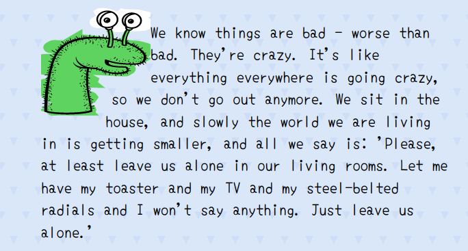
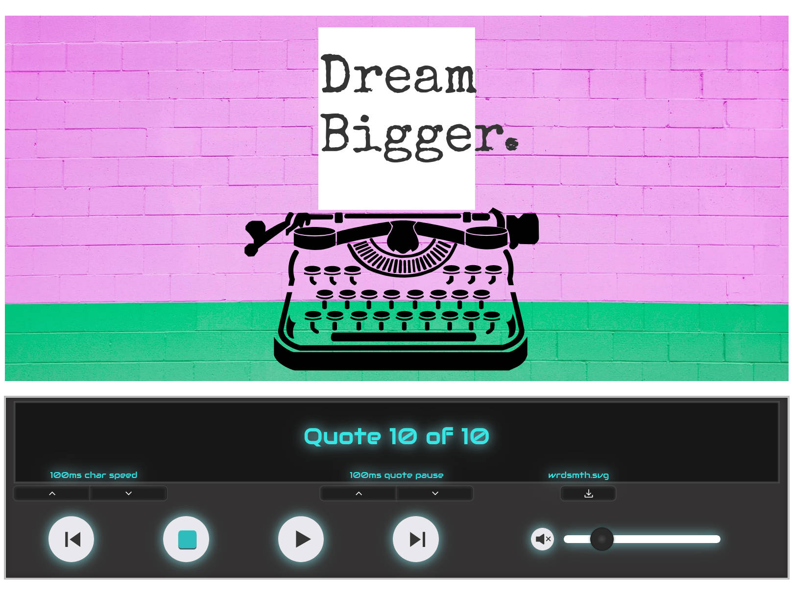

# Artifice

 **ar•ti•fice** *är′tə-fĭs* ►

    n.
    Deception or trickery.
    n.
    Something contrived or made up to achieve an end, especially by deceiving; a stratagem or ruse: synonym: wile.

This is home to some (art) experiments to improve my frontend trickery.

Each experiment is organised into a folder. If the folder has:
- A subfolder with the title "original" - I recreated the original artwork in here (with a smidge of artistic license).
- A subfolder with the title "remix" -  this is where I go off and create my own thing.
- If there is neither of these subfolders, it's likely to be my own creation.

To try out the experiments, you can install the dependencies and run a local dev server:

```bash
npm install
npm run dev
```

<!-- TOC -->
1. [Diamond Wipe](#diamond-wipe)
1. [Sin City (Microaction Graphic Novel)](#sin-city-microaction-graphic-novel)
1. [Orange, you thirsty?](#orange-you-thirsty)
1. [Johnny Cash Busted](#johnny-cash-busted)
1. [Straight Outta Some Swiss Canton](#straight-outta-some-swiss-canton)
1. [They See Me Rollin](#they-see-me-rollin)
1. [Dada](#dada)
1. [Trump channeling Kanye](#trump-channeling-kanye)
1. [Train Parallax](#train-parallax)
1. [Black to White Disks](#black-to-white-disks)
1. [LSD](#lsd)
1. [Shiny book reveal](#shiny-book-reveal)
1. [Christmas Decoration](#christmas-decoration)
1. [Logo tilt](#logo-tilt)
1. [NES Controller](#nes-controller)
1. [Star Wars - Join the Alliance Recruitment Poster](#star-wars---join-the-alliance-recruitment-poster)
1. [Star Wars - Circular Wipe Transition](#star-wars---circular-wipe-transition)
1. [Bubble text with image background](#bubble-text-with-image-background)
1. [Framed content](#framed-content)
1. [Handpuppet blockquote](#handpuppet-blockquote)
1. [WRDSMTH interactive art playground](#wrdsmth-interactive-art-playground)
1. [Kafkaesque 3D animation](#kafkaesque-3d-animation)
<!-- /TOC -->

## Diamond Wipe

A diamond-shaped wipe reveal of text.


You can check out the [codepen](https://codepen.io/robjoeol/full/NWBdYRj).

See ["diamond-wipe" folder](/diamond-wipe) for code.

## Sin City (Microaction Graphic Novel)

Add short bursts of action (animation) to a graphic novel.


It autoscrolls to show each tab at the top of the page and cycles through to the next.

I discuss this more in my post - [Make your own (interactive) graphic novel](https://www.roboleary.net/2021/07/14/make-your-own-graphic-novel.html).

You can check out the [codepen](https://codepen.io/robjoeol/full/eYVaZOr).

See ["sin-city-microaction-graphic-novel" folder](/sin-city-microaction-graphic-novel) for full info.

## Orange, you thirsty?

Whimsical take on a product card for orange juice. On hover, it reveals the product with an animation.


You can check out the [codepen](https://codepen.io/robjoeol/full/jObydPw).

See ["orange-you-thirsty" folder](/orange-you-thirsty) for full info.

## Johnny Cash Busted

Animation of Johnny Cash's arrest sheet being filled out.


You can check out the [codepen](https://codepen.io/robjoeol/full/QxeqaE).

See ["johnny-cash-busted" folder](/johnny-cash-busted) for full info.

## Straight Outta Some Swiss Canton

A poster for a NWA concert.

Inspired by [this Swissted poster](https://www.swissted.com/products/n-w-a-at-skateland-u-s-a-1988) by Mike Joyce.

See ["straight-outta-some-swiss-canton" folder](/straight-outta-some-swiss-canton) for full info.

### Original


### Remix

Animated variant.


You can check out the [codepen](https://codepen.io/robjoeol/full/YzWoMGE).

## They See Me Rollin

Kitsch wordplay of the opening lines of Chamillionaires' song *Ridin Dirty*.


You can check out the [codepen](https://codepen.io/robjoeol/pen/ZEpEKOb).

See ["they-see-me-rollin" folder](/they-see-me-rollin) for full info.

## Dada

Recreation of [this poster by Paul Rand](https://www.artic.edu/artworks/229395/dada-poster).

See ["dada" folder](/dada) for full info.

### Original


### Remix


Check out the [codepen](https://codepen.io/robjoeol/full/XWKGEoR).

## Trump channeling Kanye

Trump spitting quotes from Kanye. Quotes are fetched from the [kanye.rest API](https://kanye.rest/).


You can check out the [codepen](https://codepen.io/robjoeol/full/qeabZe).

See ["trump-channeling-kanye" folder](/trump-channeling-kanye) for full info.

## Train Parallax

Created for an article - [How to make an awesome horizontal parallax animation](https://roboleary.net/css/2020/11/17/parallax-animation.html).


You can check out the [codepen](https://codepen.io/robjoeol/pen/KKMYdQP).

See ["train parallax" folder](/train-parallax) for full info.

## Black to White Disks

This is a web rendition of the painting [Black to White Disks](https://www.wikiart.org/en/bridget-riley/black-to-white-disks-1952) by Bridget Riley.

See ["black-to-white-disks" folder](/black-to-white-disks) for full info.

### Original

The original is recreated faithfully in the 'original' folder.


### Remix


You can check out the [codepen](https://codepen.io/robjoeol/pen/rNLqZPV).

## LSD

Web rendition of the spot painting [LSD](https://www.wikiart.org/en/damien-hirst/lsd) by Damian Hirst.

See ["lsd" folder](/lsd) for full info.

### Original


### Remix


You can check out the [codepen](https://codepen.io/robjoeol/full/VwQObmw).

## Shiny book reveal

3D hover effect to open a book and reveal a synopsis of the story. I wanted to try out creating realistic reflections.


You can check out the [codepen](https://codepen.io/robjoeol/full/WmgVvx).

See ["shiny-book-reveal" folder](/shiny-book-reveal) for full info.

## Christmas Decoration

This an idea for a customisible Christmas decoration. It is like an accordian of cards. There are different designs on each side, you can fold them to create different combinations.


You can check out the [codepen](https://codepen.io/robjoeol/full/WNojGdm).

See ["christmas-decoration" folder](/christmas-decoration) for full info.

## Logo tilt

I wanted to try out a goofy idea. I wanted to animate a website’s logo so
that it would fall over when you scroll down, and right itself when you
scroll up. In particular, I wanted the logo to be a head or have a
cartoonish look.


You can check out the [codepen](https://codepen.io/robjoeol/full/LYeQRwq).

See ["logo-tilt" folder](/logo-tilt) for full info.

## NES Controller

This is a CSS recreation of a NES (Nintendo)  game controller. It is an experiment to see the impact shadows can have on the realism of a design. You can toggle the shadows on/off to judge for yourself!


You can check out the [codepen](https://codepen.io/robjoeol/pen/ZELzVPV).

See ["nes-controller" folder](/nes-controller) for code.

## Star Wars - Join the Alliance Recruitment Poster

Star Wars recruitment poster, sort of.


You can check out the [codepen](https://codepen.io/robjoeol/pen/KKgKzXp).

See ["star-wars-join-the-alliance" folder](/star-wars-join-the-alliance) for full info.

## Star Wars - Circular Wipe Transition

Circular wipe transition of scenes.

Since the [`mask` CSS property](https://developer.mozilla.org/en-US/docs/Web/CSS/mask) is not fully implemented across browsers, I looked for alternatives that have better support.

I created 2 versions:
1. CSS `clip-path` version: The [`clip-path`](https://developer.mozilla.org/en-US/docs/Web/CSS/clip-path) property is the basis of the animation. The transition edges are hard. You can see it in [this codepen](https://codepen.io/robjoeol/full/YzjQmoG).
1. SVG `mask` version: A SVG [`mask`](https://developer.mozilla.org/en-US/docs/Web/SVG/Element/mask) is used. The transition edges are soft. You can see it in [this codepen](https://codepen.io/robjoeol/full/dyjzvdb).

I discuss these implementations in the post - [An awesome, cross-browser Star Wars circular wipe transition? CSS houdini vs clippath vs mask](https://www.roboleary.net/css/2023/01/16/awesome-cross-browser-starwars-circular-wipe-transition-css-houdini-clipath-mask.html).


See ["star-wars-circular-wipe" folder](/star-wars-circular-wipe/) for code.

## Bubble text with image background

I wanted to see if I could create text with a background image and a stroked outline.

To achieve this, the following non-standard properties are required: `-webkit-background-clip: text` and `-webkit-text-stroke`.

You can check out the [codepen](https://codepen.io/robjoeol/full/OJwQYvy).


See ["bubble-text-image-background" folder](/bubble-text-image-background/) for code.

## Framed content

I wanted to see if you can have content with a picture frame as a border. The border image should enclose the content whatever its dimensions.

I used the `border-image` family of properties. I use `border-image-repeat: repeat;` to handle when the width of the content is greater than the border image width. This degrades the image fidelity but in this case, it looks fine.


You can check out the [codepen](https://codepen.io/robjoeol/full/dygmZJr).

See ["framed-content" folder](/framed-content/) for code.

## Handpuppet blockquote

Have an image of a handpuppet affect the outline of a quotation. Uses `shape-outside` property.



You can check out the [codepen](https://codepen.io/robjoeol/full/yLRKvLW).

See ["handpuppet-blockquote" folder](/handpuppet-blockquote/) for code.

## WRDSMTH interactive art playground

An interactive playground of the signature artwork of street artist WRDSMTH. [WRDSMTH](https://www.wrdsmth.com/) is a Los Angeles-based street artist known for his iconic image of a vintage typewriter featuring different sheets of inspirational text.



See ["wrdsmth" folder](/wrdsmth/) for code.

### Attribution

- Icons from [Material Design](https://material.io/resources/icons/?style=baseline).
- Original audio sourced from Freesound:
	- [Typewriter by exterminat](https://freesound.org/people/exterminat/sounds/164807/)

## Kafkaesque 3D animation

A 3D CSS animation inspired by a quotation from the late, great author Franz Kafka:

> A book must be the axe for the frozen sea in us

You can check out the [codepen](https://codepen.io/robjoeol/full/VRVEOK).

See ["kafkaesque" folder](/kafkaesque/) for code.
