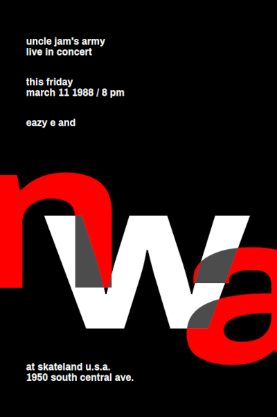

# Straight Outta Some Swiss Canton

A poster for a NWA concert.

## Original

I changed the background colour, and used a different sans-serif typeface. Otherwise, it the same as the original!

## Remix

It features a pulsating police siren with accompanying sound effects!

Fitting for the world's most dangerous rap crew.

Check out the [live demo](https://codepen.io/robjoeol/full/YzWoMGE).

The code is available in the "remix" folder.

#### Lesson Learned

- The performance was a bit sluggish on mobile. To optimise it, I did the following:

  - Reduced the value of `perspective`.
  -  Set the `will-change` property for the 3D transformations.  This lead to a decrease in the painting time by  85%.

    
    **before**

    
    **after**

  ## Credits

1. Inspired by [this Swissted poster](https://www.swissted.com/products/n-w-a-at-skateland-u-s-a-1988) by Mike Joyce.
1. Siren sound from [Freesound](https://freesound.org/people/MultiMax2121/sounds/156869/) by MultiMax2121.
